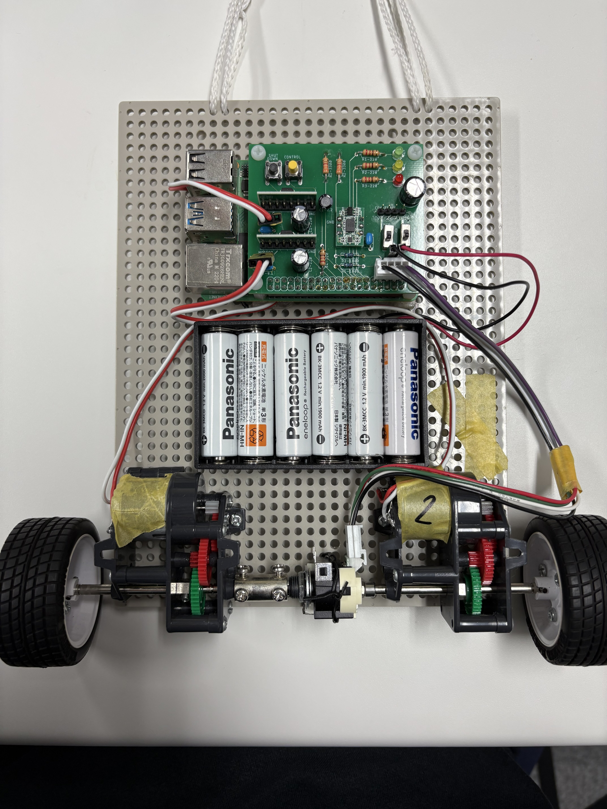

# gcl-pendulum
Tatsuya Shiotsuka, Shodai Hirayama, Sohta Katoh, Mai Bando, Kyushu University, Japan. 

Software version 1 published on January 8, 2025. [Download here](https://github.com/ku-gcl/gcl-pendulum/releases/tag/ver1).

This repository contains the source code for controlling an inverted pendulum.

 

<!---->

## Contributors
- [Tatsuya Shiotsuka](https://github.com/SHIO777)
  - Code maintain
  - Control algorithm develop (see [src](src/) folder)
  - Documentation Manage
- [Shodai Hirayama](https://github.com/sho-da)
  - Mechanical Design
  - Control Algorithm Develop (see [src](src/) folder)
  - Electronic Circuit Design
- [Katoh Sohta](https://github.com/KATOHSOHTA)
  - Electronic Circuit Design


## Setup
### Ubuntu 20.04
Install Ubuntu 20.04 on Raspberry Pi

#### Build

```
cd ~/
git clone https://github.com/ku-gcl/gcl-pendulum.git
cd ~/gcl-pendulum
source Tools/setup.sh
```

### More detail
Please check instruction in [wiki](https://github.com/ku-gcl/gcl-pendulum/wiki).

## Reference
- 別府 伸耕. 「月着陸船アポロに学ぶ確率統計コンピュータ」 トランジスタ技術, CQ出版, 2019年7月号.
